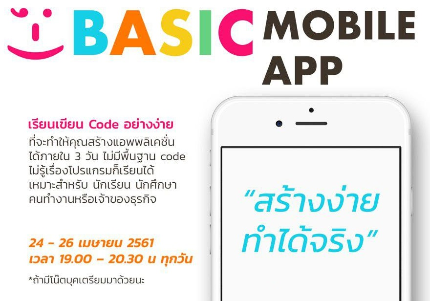

# Mobile app สร้างง่าย ทำได้จริง

## เนื้อหาประกอบคอร์ส
* วันที่ 1
    * [รู้จักกันหน่อยไหม :)](https://gitpitch.com/mastertraining/basic-mobile-app-intro/p?p=day-1#)
    * [เว็บไซต์หลักของ Ionic framework](https://ionicframework.com)
    * [Ionic Creator แค่ลากวางก็ได้ App!](https://creator.ionic.io)
* วันที่ 2
	* [สไลด์ของวันที่ 2](https://gitpitch.com/mastertraining/basic-mobile-app-intro/p?p=day-2#)
    * [การติดตั้ง Ionic](installing-ionic.md)
    * [โครงสร้างโปรเจค](tutorial-structure.md)
    * [มาสร้าง Ionic app ตัวแรกของเรากันเถอะ](tutotial-ionic.md)
* วันที่ 3
	* [สไลด์ของวันที่ 3](https://gitpitch.com/mastertraining/basic-mobile-app-intro/p?p=day-3#)
    * [Ionic Cloud](https://dashboard.ionicframework.com)
    * สร้างและทำงานร่วมกับ Ionic Cloud
    * คำสั่ง Git เบื้องต้น
    * ดู App ผ่าน Ionic View
    * App ถ่ายรูป
    * App พูดได้
    * ไป Academy กัน

## โปรแกรมที่ต้องใช้
* macOS
    * [NodeJs](https://nodejs.org/dist/v8.11.1/node-v8.11.1-x64.msi)
    * [VSCode](https://go.microsoft.com/fwlink/?Linkid=620882)
    * [Git](https://git-scm.com/download/mac)
* Windows 64-bit
    * [NodeJs](https://nodejs.org/dist/v8.11.1/node-v8.11.1-x64.msi)
    * [VSCode](https://go.microsoft.com/fwlink/?Linkid=852157)
    * [Git](https://github.com/git-for-windows/git/releases/download/v2.16.2.windows.1/Git-2.16.2-64-bit.exe)
* Windows 32-bit
    * [NodeJs](https://nodejs.org/dist/v8.11.1/node-v8.11.1-x64.msi)
    * [VSCode](https://go.microsoft.com/fwlink/?Linkid=623230)
    * [Git](https://github.com/git-for-windows/git/releases/download/v2.16.2.windows.1/Git-2.16.2-32-bit.exe))
* Android
    * [Ionic Creator](https://play.google.com/store/apps/details?id=io.ionic.creator)
    * [Ionic DevApp](https://play.google.com/store/apps/details?id=io.ionic.devapp)
    * [Ionic View](https://play.google.com/store/apps/details?id=com.ionicframework.view)